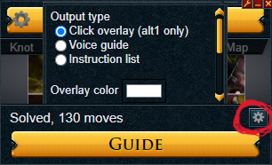
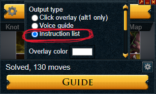
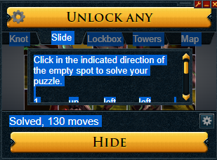
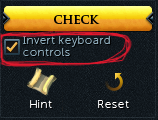

# ZSolver

ZSolver is a full-stack Java application for solving 5x5 'Slider' puzzles, specifically designed for those commonly encountered in the game RuneScape.
ZSolver is intended to integrate with Alt1 Toolkit's [Clue Solver](https://runeapps.org/clue) and execute movements into the user's game client to automate solving the puzzle.

## Interfacing with Alt1 Clue Solver

Interfacing with Alt1 Toolkit's Clue Solver is required to obtain an input string of commands for ZSolver to execute.
Clue Solver hooks directly into a user's RuneScape client allowing it to read and calculate the solution to puzzles as they appear on screen.

By default, Clue Solver's 'Output type' setting for the solution is "Click overlay", visible by clicking the settings cog in the bottom right of the UI (circled in red below).

Simply click on the radio button for "Instruction List" to select it, and the settings cog again to close the interface.

Now, when clicking "GUIDE" to see the generated solution, users will see a list of commands they can easily copy to Clipboard with Ctrl+A --> Ctrl+C :

### RS3 Engine Update (December 2023)

Runescape 3 released a major engine update in December 2023, changing interface scaling and affecting Alt1's ability to read and interact with the RS3 client.

To resolve issues relating to this, follow Alt1 Creator Skillbert's step-by-step guide found [here](https://runeapps.org/forums/viewtopic.php?id=1614).

## Executing Instructions with ZSolver

Once the Instruction List has been copied to Clipboard, users are ready to launch ZSolver and paste (Ctrl+V) the list into the main input window. 

ZSolver will execute the instruction list on the application in focus, so **it is crucial that users return focus to their game client** after pressing "Submit".
The number shown in the "Delay Time from SUBMIT" field represents the time delay in ms between pressing Submit and start of execution, and defaults to 3 seconds.
Additionally, there is an optional "Auto-Return to RS Client" toggle.

Finally, before pressing "Submit" users must ensure the "Invert keyboard controls" checkbox **is selected** in their RuneScape client puzzle interface. 

ZSolver is designed to handle the Instruction List string as-is, allowing for fast/easy use with the Ctrl+A/C/V commands to quickly highlight, copy, and paste the Instruction List.

## App Configurations

ZSolver has some features/settings below the main input window which can be configured to affect how it executes:

- **Base Delay Value** - This is a static delay (ms) between executing any two movement commands, and the minimum possible delay (accounting for Variable). Defaults to 120 ms.

- **Variable Delay Value** - This is a randomized delay (ms) between executing any two commands. A random integer between 0 and the value input is generated each move and added to the Base Delay Value. Defaults to 80 ms.

- **Delay Time from SUBMIT** - The time delay in ms between when a user clicks "Submit" and beginning of command execution, generally used as a time buffer to allow users to focus their game client. Defaults to 3000 ms.

- **Auto-Return to RS Client** - If checked, this will attempt to automatically return focus to the game client after a user clicks "Submit" by inputting ALT+F1. However, this method assumes the game client was the previous focused application and is not 100% reliable.

## Future Development

**Alternative Data Structures** -
Considering alternative data structures and back-end strategies for data processing which could be more efficient. 

**Additional and Improved Features** - Additional features to add utility and specifity to ZSolver. In particular, considering possibilities for direct inputs (no focus needed) and/or improvements to the auto-return feature.

**Utility for Other Puzzle Types** - Adding utility for solving other types of puzzles which are encountered in RuneScape and other games, such as 5x5 Tower puzzles.

## Contact
With any questions, concerns, or suggestions please reach out to Jacob Elbirt at jelbirt@worcester.edu.
